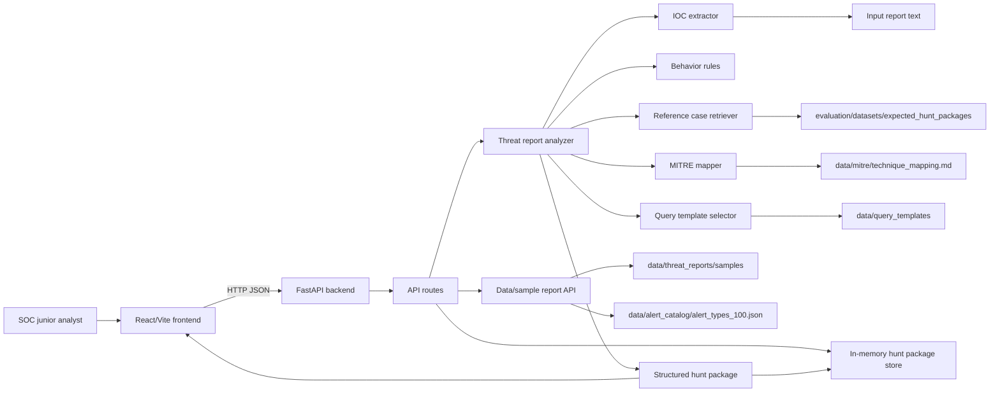
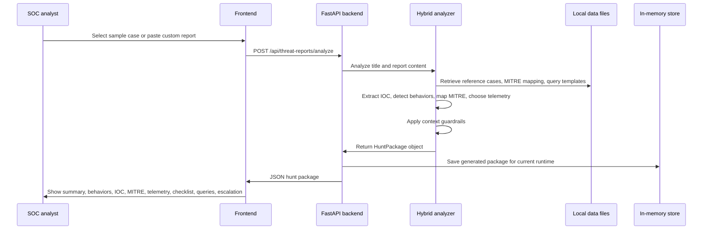

# MVP Architecture Diagram

This document describes the current MVP architecture for the AI Threat Intel to Hunt Package Assistant.

## Component View

## End-to-End Data Flow

## Current Runtime Components

| Component | Technology | Location | Purpose |
| --- | --- | --- | --- |
| Frontend | React, Vite, TypeScript | `frontend/` | Main UI for selecting reports, submitting analysis, and reading hunt package output. |
| Backend API | FastAPI, Pydantic | `backend/` | Exposes health, data, threat report analysis, and generated hunt package endpoints. |
| Analyzer | Python hybrid logic | `backend/app/services/threat_reports/` | Combines rules, retrieval, IOC extraction, MITRE mapping, query selection, and guardrails. |
| Data | Markdown, JSON, KQL, SPL, YAML | `data/` | Stores 100 sample reports, alert catalog, query templates, log schemas, and references. |
| Evaluation | Python runners | `evaluation/` | Runs 100-case quality gate and holdout smoke tests. |
| Store | In-memory Python store | `backend/app/services/hunt_packages/` | Keeps generated hunt packages during the running backend process. |

## Main API Calls

| Method | Endpoint | Description |
| --- | --- | --- |
| GET | `/api/health` | Backend health check. |
| GET | `/api/data/sample-reports` | List available sample alert/report cases. |
| GET | `/api/data/sample-reports/{slug}` | Load one sample report. |
| POST | `/api/threat-reports/analyze` | Convert a report into a hunt package. |
| GET | `/api/hunt-packages` | List generated packages from the current runtime. |
| GET | `/api/hunt-packages/{package_id}` | Read one generated package from the current runtime. |

## MVP Boundaries

- The MVP uses local files and in-memory storage.
- It does not require a database yet.
- It does not call an LLM yet; the analyzer is hybrid rule-based plus retrieval.
- Query drafts are investigation starting points and must be adjusted to the real SIEM/EDR schema before production use.
