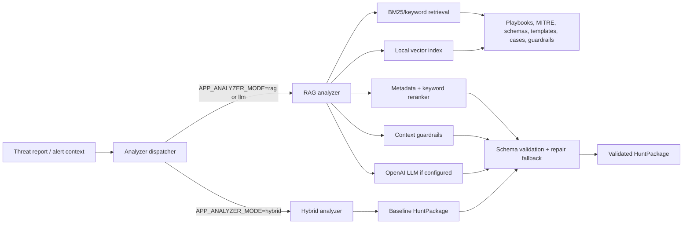

# RAG/LLM Analyzer Upgrade

This document describes the upgraded analyzer path added after the MVP hybrid analyzer.

## What Is Implemented

The app now supports three analyzer modes:

- `hybrid`: deterministic MVP analyzer using rules, retrieval from expected cases, IOC extraction, MITRE mapping, query templates, and guardrails.
- `rag`: retrieves playbooks, MITRE references, telemetry schemas, query templates, sample cases, expected hunt packages, and guardrail docs before returning a validated hunt package.
- `llm`: same as `rag`, but intended for OpenAI-backed generation when `APP_AI_PROVIDER=openai` and `APP_OPENAI_API_KEY` are configured.

If no OpenAI API key is configured, `rag`/`llm` safely fall back to the hybrid analyzer and append RAG citations in `analyst_notes`.

## Implemented Requirements

| Requirement | Implementation |
| --- | --- |
| Knowledge data for RAG | `data/playbooks/`, `data/mitre/`, `data/query_templates/`, `data/log_schemas/`, `data/rag/reference/`, `data/guardrails/`, `evaluation/datasets/expected_hunt_packages/` |
| Indexing pipeline | `backend/app/services/rag/indexer.py`, `knowledge_loader.py`, `vector_store.py` |
| Retrieval logic | `backend/app/services/rag/retriever.py`, `keyword_retriever.py`, `reranker.py`, `guardrails.py` |
| LLM generation | `backend/app/services/rag/llm_client.py` using OpenAI Chat Completions through stdlib HTTP |
| Schema validation | `backend/app/services/rag/validator.py` using Pydantic `HuntPackage` |
| Guardrails | Pre-classification, retrieval metadata filtering, output filtering in `guardrails.py` |
| Evaluation | `evaluation/runners/run_rag_comparison.py` plus existing 100-case and holdout runners |
| API/config | `GET /api/rag/status`, `POST /api/rag/reindex`, analyzer config in `backend/app/core/config.py` |

## Data Flow



## Retrieval Strategy

The analyzer now uses hybrid retrieval instead of semantic-only search:

1. Classify intent/context first, such as `endpoint`, `cloud_iam`, `cloud`, `identity`, `saas_oauth`, `developer_platform`, `linux`, or `dns`.
2. Retrieve semantic candidates from the local/OpenAI embedding index.
3. Retrieve keyword candidates with BM25 to preserve exact technical tokens such as `AttachPolicy`, `SetIamPolicy`, `deploy key`, `repository secrets`, `mshta.exe`, and `cron`.
4. Rerank candidates using semantic score, BM25 score, metadata fit, technical keyword hits, source type, and blocked-context penalties.
5. Apply output guardrails after LLM/baseline generation.

This is better for SOC reports than semantic-only retrieval because exact technical terms often matter as much as broad semantic similarity.

## Cloud IAM Guardrail

Cloud IAM admin policy attachment is handled as a dedicated `cloud_iam` context.

Cloud IAM allows:

- Telemetry: `cloud_audit`, `auth`, `proxy`
- MITRE: `T1098`, `T1098.003`, `T1078.004`
- Queries: Cloud IAM admin policy attachment templates

Cloud IAM blocks:

- Windows service persistence
- Registry Run Key
- mshta
- LSASS
- Cloud Instance Metadata API unless metadata service evidence is explicit

Cloud IAM correlation should use actor/principal, target user/role/service account, resource, source IP, user agent, and time window rather than endpoint host/process chain.

## Config

Place config in `backend/.env`:

```text
APP_ANALYZER_MODE=rag
APP_AI_PROVIDER=openai
APP_OPENAI_API_KEY=
APP_OPENAI_CHAT_MODEL=gpt-4.1-mini
APP_OPENAI_EMBEDDING_MODEL=text-embedding-3-small
APP_VECTOR_STORE=local
APP_RAG_TOP_K=8
```

`APP_OPENAI_API_KEY` should stay empty in git. Fill it only in your local `.env`.

## API

Check RAG status:

```powershell
Invoke-RestMethod -Uri "http://127.0.0.1:8000/api/rag/status" -UseBasicParsing
```

Rebuild RAG index:

```powershell
Invoke-RestMethod -Method Post -Uri "http://127.0.0.1:8000/api/rag/reindex" -UseBasicParsing
```

Analyze still uses the existing endpoint:

```text
POST /api/threat-reports/analyze
```

## Security Notes

- The default local index uses local hashed embeddings and does not call any external API.
- OpenAI calls only happen when `APP_AI_PROVIDER=openai` and `APP_OPENAI_API_KEY` are both configured.
- For production SOC data, add redaction before LLM calls and keep audit logs for outbound model requests.
